# Organización de Lenguajes y Compiladores 2 -N-
## Proyecto 1
### Segundo Semestre 2024
```js
Universidad San Carlos de Guatemala
Programador: Pablo Andres Rodriguez Lima
Carne: 202201947
Correo: pabloa10rodriguez@gmail.com
```
---
## Descripción del Proyecto
El intérprete para el lenguaje de programación OakLand ha sido desarrollado. Este lenguaje, inspirado en la sintaxis de Java, se destaca por su capacidad para manejar múltiples paradigmas de programación, incluyendo la orientación a objetos, la programación funcional y la procedimental. Se ha implementado también una plataforma sencilla pero robusta, que permite crear, abrir, editar e interpretar código escrito en OakLand de manera eficiente.

Informacion sobre codigo de OakLand:

### Frontend
- Desarrollado en html, css y js.
- Patron de diseño: Observer
    Observer: Se utiliza para notificar a los observadores (componentes de la interfaz grafica) cuando se realice una accion en el editor de texto.
- Desplegado en: https://pablor03.github.io/OLC2_Proyecto1_202201947/frontend/ 

### Backend
- Desarrollado en Js con herramienta para analisis de gramatica independiente del contexto (Pegjs).
- Patron de diseño: Visitor
    Visitor: Se utiliza para recorrer el arbol de analisis sintactico y realizar las acciones correspondientes a cada nodo.

---

---

# Explicación de la estructura del proyecto

## Frontend 
El frontend del proyecto se encuentra en la carpeta frontend, en la cual se encuentran los archivos html, css y js que conforman la interfaz grafica del proyecto.

#### [index.html](https://github.com/PabloR03/OLC2_Proyecto1_202201947/blob/main/frontend/index.html) 
Archivo html que contiene la estructura de la pagina web, en el se importan los archivos css y js necesarios para el funcionamiento de la pagina.

#### [index.css](https://github.com/PabloR03/OLC2_Proyecto1_202201947/blob/main/frontend/index.css)
Archivo css que contiene los estilos de la pagina web.

#### [index.js](https://github.com/PabloR03/OLC2_Proyecto1_202201947/blob/main/frontend/index.js) 

Archivo js que contiene la logica de la pagina web, en el se realizan las peticiones al backend y se actualiza la interfaz grafica.

---
(Para hacer mas explicito el codigo se explicara como se implemento el patron visitor para la declaracion de variables, mostrando todos los objetos necesarios para su implementacion, ya que es repetitivo se usaria  el mismo procedimiento para las demas instrucciones)
## Backend

El backend del proyecto se encuentra en la carpeta backend, en la cual se encuentran los archivos necesarios para el analisis del codigo escrito en OakLand.

### [Analizador.pegjs](https://github.com/PabloR03/OLC2_Proyecto1_202201947/blob/main/backend/Analizador.pegjs)

Archivo que contiene la gramatica del lenguaje OakLand, en el se definen las reglas de produccion del lenguaje.

Antes de explicar la gramatica se explicara el patron de diseño visitor.
Se implemento el patron de diseño visitor para recorrer el arbol de analisis sintactico y realizar las acciones correspondientes a cada nodo.
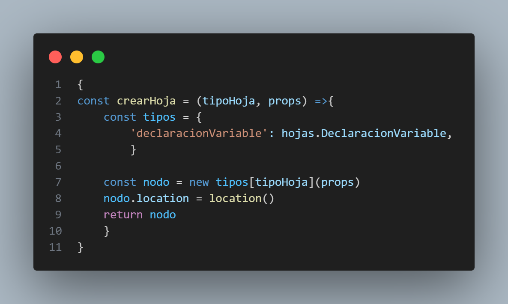

Ejemplo de gramatica desarrollada en pegjs:

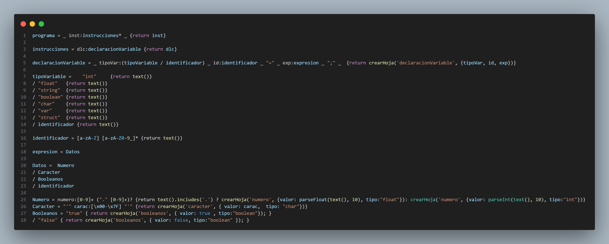

Esta herramienta necesita de un comando en consola para generar el archivo js que contiene la gramatica en codigo js.


```bash
pegjs Analizador.pegjs

```
### [Hojas.js](https://github.com/PabloR03/OLC2_Proyecto1_202201947/blob/main/backend/Hojas/Hojas.js)
Archivo que contiene las clases que representan las hojas del arbol de analisis sintactico.
constructor: Se encarga de inicializar los atributos de la clase.
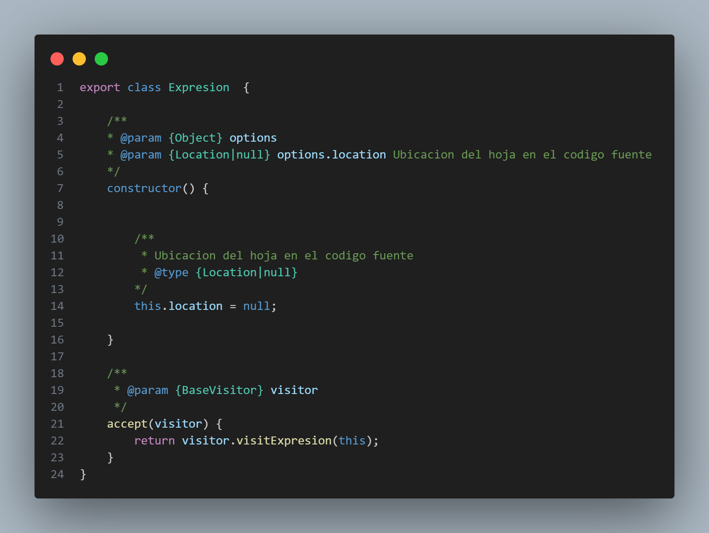

Implementacion de la clase Hojas para la declaracion de variables:

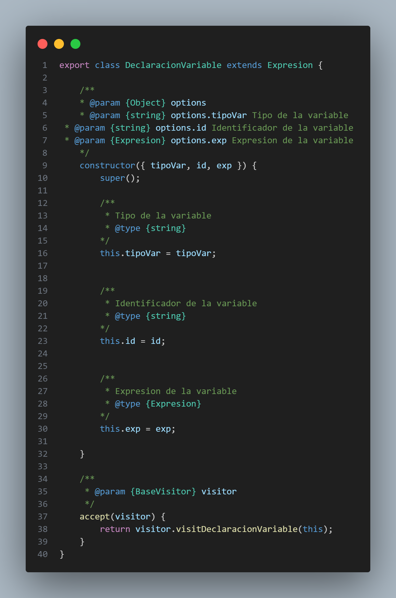

### [Visitor.js](https://github.com/PabloR03/OLC2_Proyecto1_202201947/blob/main/backend/Patron/Visitor.js)
Archivo que contiene la clase visitor que se encarga de recorrer el arbol de analisis sintactico y realizar las acciones correspondientes a cada nodo.

llamada al metodo visitar de la clase visitor:
Este se encarga de acceder a la clase correspondiente a la hoja y realizar la accion correspondiente.

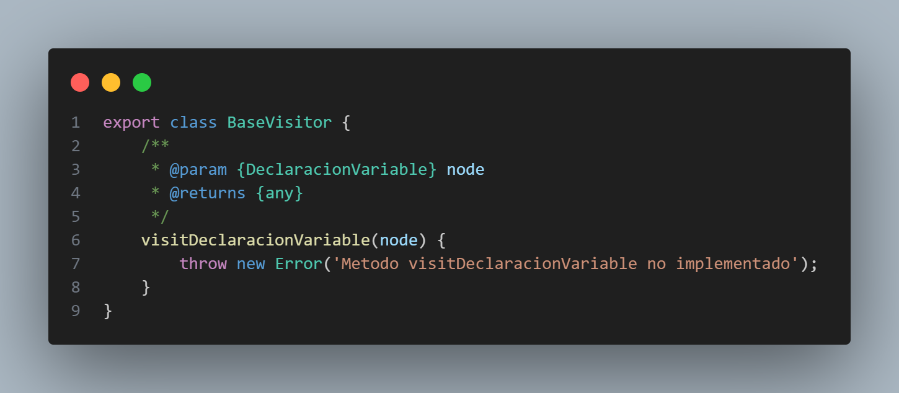

### [Interprete.js](https://github.com/PabloR03/OLC2_Proyecto1_202201947/blob/main/backend/Interprete.js)
Archivo que contiene la clase interprete que se encarga de interpretar el codigo escrito en OakLand.
Constructor: Se encarga de inicializar los atributos de la clase.
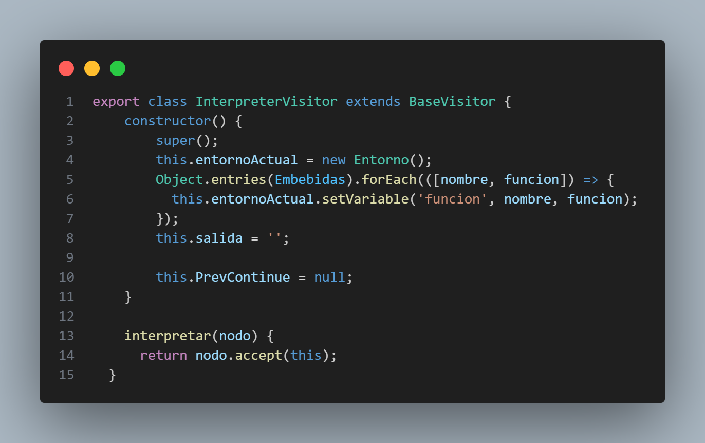

Uso de Nodo para la declaracion de variables:
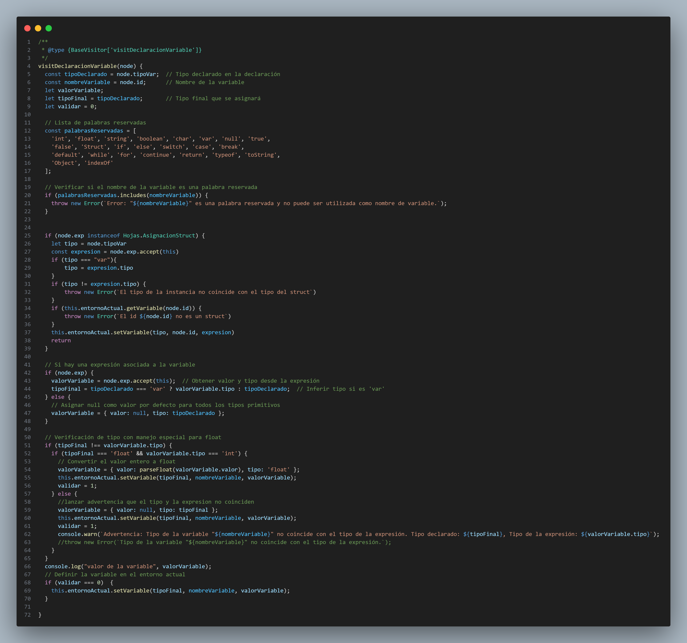
Explicacion de la implementacion de la declaracion de variables:
- Se crea un objeto de la clase Nodo que contiene el nombre de la variable, el valor que se le asignara y el tipo de la variable.
- Se llama al metodo visitar de la clase visitor y se le pasa el objeto de la clase Nodo.
- Se accede a la clase correspondiente a la hoja y se realiza la accion correspondiente.

Puntos aconsiderar:
- Se valida si la variable ya existe en la tabla de simbolos, si no existe se agrega, si ya existe se actualiza su valor.
- Se valida si el valor que se le asigna a la variable es un correspondiente al tipo que tiene, se guarda el valor, si no se guarda como null.

### [Entorno.js](https://github.com/PabloR03/OLC2_Proyecto1_202201947/blob/main/backend/oakLand/Entorno/Entorno.js)
Archivo que contiene la clase entorno que se encarga de almacenar las variables declaradas en el codigo.
Constructor: Se encarga de inicializar los atributos de la clase.

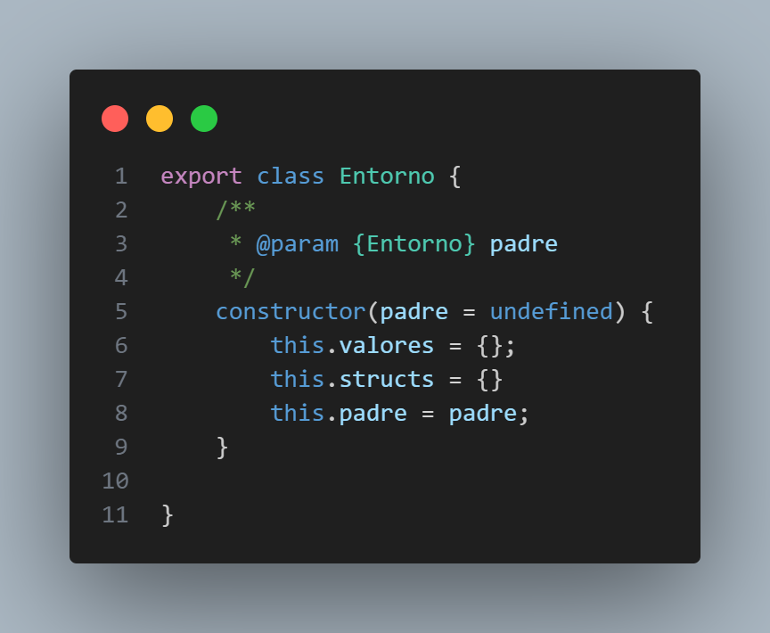

Metodo assingVariable: Se encarga de agregar una variable a la tabla de simbolos y guardar el entorno al que pertenece.

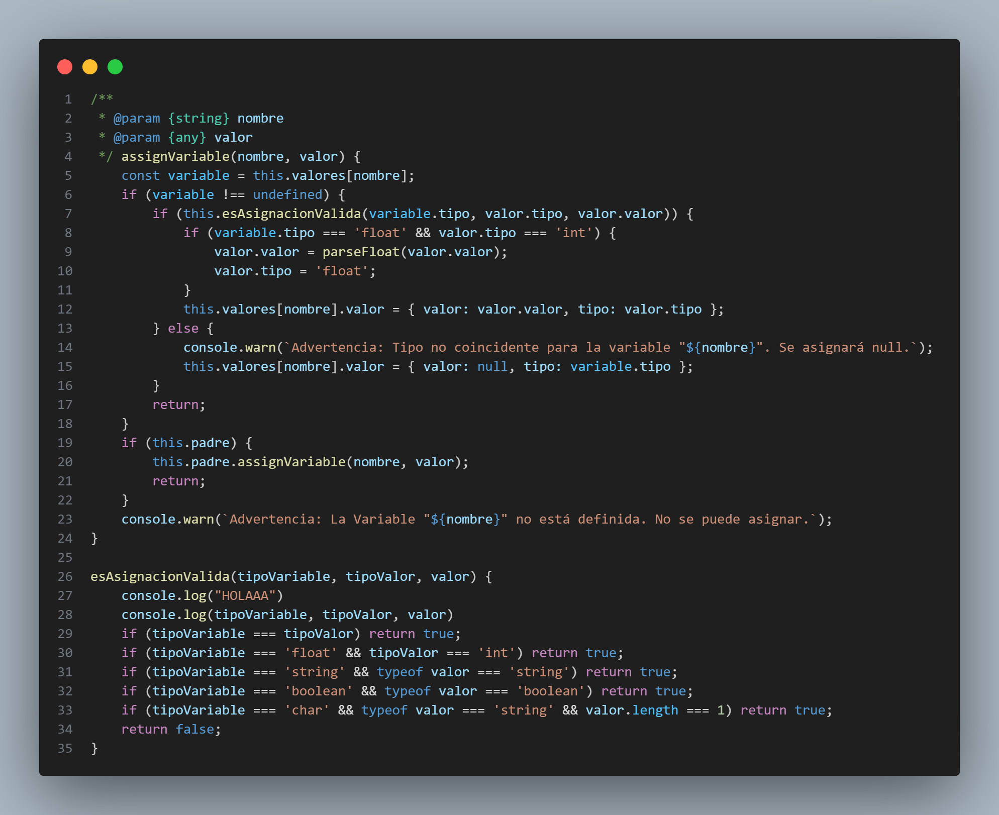

Expliacion de la implementacion de la declaracion de variables:
- Se valida si la variable ya existe en la tabla de simbolos, si no existe se agrega, si ya existe se marcara como error.
- Se valida si el valor que se le asigna a la variable es un correspondiente al tipo que tiene, se guarda el valor, si no se guarda como null.

### [TablaSimbolos.js](https://github.com/PabloR03/OLC2_Proyecto1_202201947/blob/main/frontend/ManejadorArchivos.js)
Archivo que contiene la clase tablaSimbolos que se encarga de almacenar los entornos declarados en el codigo.

funcion mostrarTabla: Se encarga de mostrar la tabla de simbolos en consola y generara un html con los datos encontrados.

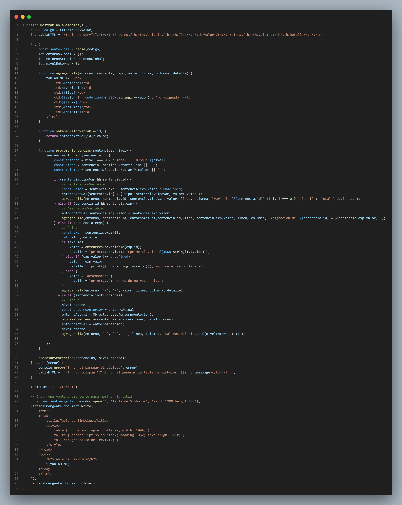

ya que al ejecturar la entrada de codigo se crean los objetos de las clases necesarias para la implementacion del patron visitor, se procede a recorrer el arbol de analisis sintactico y realizar las acciones correspondientes a cada nodo. Sabiendo que este puede devolver un Array con las sentencias utilizadas en el codigo, de aca se obtienen las variables usadas para la tabla de simbolos.

### [TablaErrores.js](https://github.com/PabloR03/OLC2_Proyecto1_202201947/blob/main/frontend/ManejadorArchivos.js)
Archivo que contiene la clase tablaErrores que se encarga de almacenar los errores semanticos encontrados en el codigo.

funcion mostrarErrores: Se encarga de mostrar los errores semanticos en consola y generara un html con los datos encontrados.

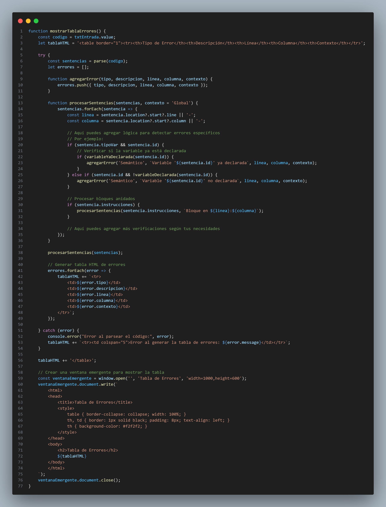

ya que al ejecturar la entrada de codigo se crean los objetos de las clases necesarias para la implementacion del patron visitor, se procede a recorrer el arbol de analisis sintactico y realizar las acciones correspondientes a cada nodo. Sabiendo que este puede devolver un Array con los sentencias utilizadas en el codigo, atraves de un catch que captura los errores es el valor de los que son mostrados.

---


