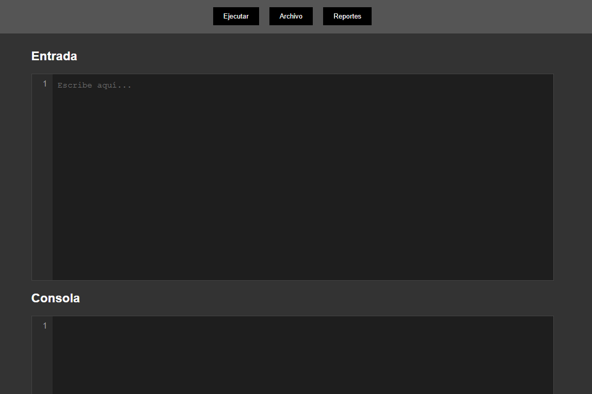
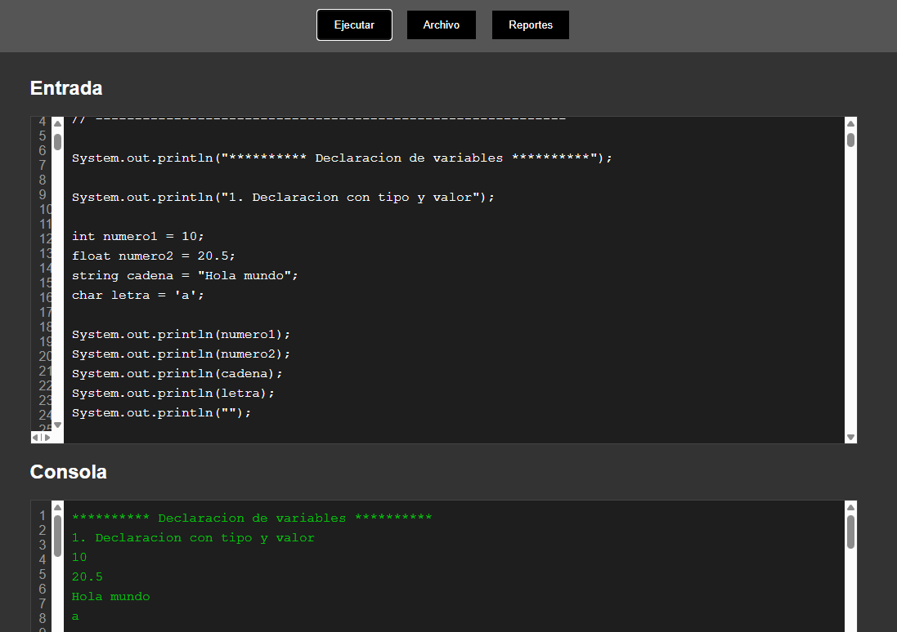
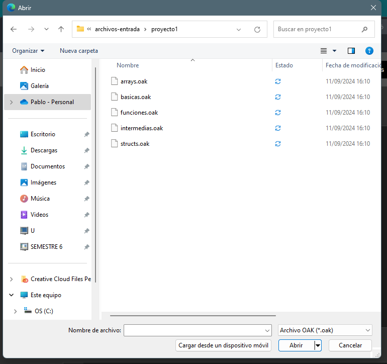
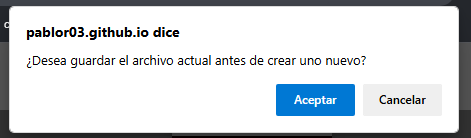
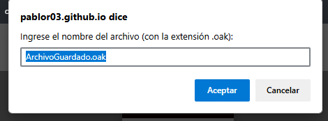
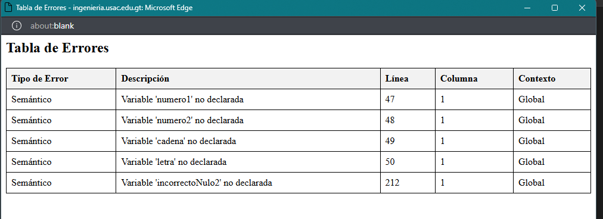
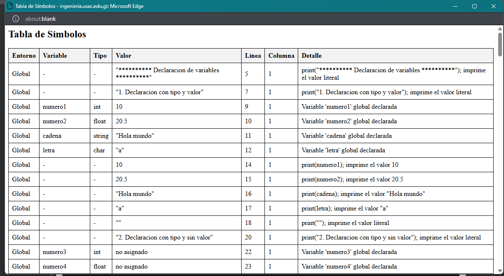

# Organizacion de Lenguajes y Compiladores 2 -N-
## Proyecto 1
### Segundo Semestre 2024
```js
Universidad San Carlos de Guatemala
Programador: Pablo Andres Rodriguez Lima
Carne: 202201947
Correo: pabloa10rodriguez@gmail.com
```
---
## Descripción del Proyecto
El intérprete para el lenguaje de programación OakLand ha sido desarrollado. Este lenguaje, inspirado en la sintaxis de Java, se destaca por su capacidad para manejar múltiples paradigmas de programación, incluyendo la orientación a objetos, la programación funcional y la procedimental. Se ha implementado también una plataforma sencilla pero robusta, que permite crear, abrir, editar e interpretar código escrito en OakLand de manera eficiente.

Para aprovechar al máximo nuestro programa, asegúrate de cumplir con los siguientes requisitos mínimos:

## Objetivos
* Objetivo General:
    * Desarrollar y presentar un programa de software integral que permite usar una interfaz grafica para abrir, guardar y revisar errores semanticos.

* Objetivos Específicos:
    * Crear una interfaz de usuario amigable que permita a los usuarios gestionar proyectos de manera efectiva.
    * Desarrollar funcionalidades que permitan visualizar los errores.

---
## Como usar el programa
Para utilizar nuestro programa, primero debes acceder a 'https://pablor03.github.io/OLC2_Proyecto1_202201947/frontend/' desde nuestro repositorio de GitHub. Una vez habilitado en tu navegador, puedes abrirlo en tu IDE o editor de texto preferido. A continuación, te explicaremos cómo utilizar nuestro programa.

### Interfaz gráfica
Una vez que hayas abierto nuestro programa, verás una interfaz gráfica como la siguiente:


### Botones
En la parte superior de la interfaz gráfica, encontrarás una barra de menú con los siguientes botones: Ejecutar, Archivo y Reportes. A continuación, te explicaremos para qué sirve cada uno de ellos.

#### Ejecutar
Este botón te permite ejecutar el código que has escrito en el cuadro de texto que se encuentra en la parte inferior de la interfaz gráfica. Una vez que hayas ejecutado el código, podrás ver los resultados en la consola que se encuentra en la parte inferior de la interfaz gráfica.


##### Archivo
Este boton te permite Abrir, Crear y Guardar un archivo con la extension .oak. Una vez que hayas creado el archivo, podrás editarlo en el cuadro de texto que se encuentra en la parte inferior de la interfaz gráfica.
![btnArchivo]](image-2.png)

- ###### Abrir
Este botón te permite abrir un archivo con la extensión .oak. Una vez que hayas abierto el archivo, podrás editarlo en el cuadro de texto que se encuentra en la parte inferior de la interfaz gráfica.

- ###### Crear
Este botón te permite crear un archivo con la extensión .oak. Una vez que hayas creado el archivo, podrás editarlo en el cuadro de texto que se encuentra en la parte inferior de la interfaz gráfica.


- ###### Guardar
Este botón te permite guardar el archivo que estás editando en el cuadro de texto que se encuentra en la parte inferior de la interfaz gráfica. Una vez que hayas guardado el archivo, podrás abrirlo en el futuro y editarlo en el cuadro de texto que se encuentra en la parte inferior de la interfaz gráfica.


##### Reportes

- ###### Errores
Este botón te permite ver los reportes de errores que se han generado al ejecutar el código que has escrito en el cuadro de texto que se encuentra en la parte inferior de la interfaz gráfica. Una vez que hayas ejecutado el código, podrás ver los reportes de errores en una ventana emergente.


- ###### Tabla de Simbolos
Este botón te permite ver la tabla de símbolos que se ha generado al ejecutar el código que has escrito en el cuadro de texto que se encuentra en la parte inferior de la interfaz gráfica. Una vez que hayas ejecutado el código, podrás ver la tabla de símbolos en una ventana emergente.


A continuacion te dejo unas cadenas simples de entrada con la cual te familiarizaras con el programa.

```java
//Cadena de entrada 1
int a = 5;
int b = 10;
int c = a + b;
System.out.println(c);
// Salida esperada: 15
```
```java
//Cadena de entrada 2
System.out.println("********** Funciones no recursivas sin parámetros **********");
System.out.println("1. void");
void saludar() {
    System.out.println("Hola");
}
saludar();
System.out.println("");
System.out.println("2. Con retorno");
int sumar() {
    return 10 + 20;
}
System.out.println(sumar());
// Salida esperada: Hola, 30
```

---
Para obtener más información sobre cómo implementar nuestro programa, consulta el manual Tecnico puedes acceder a https://github.com/PabloR03/OLC2_Proyecto1_202201947/blob/main/Documentacion/Manual_Tecnico.md

Archivos de Prueba adicionales: https://github.com/damianpeaf/OLC2_2S2024/tree/main/archivos-entrada/proyecto1 